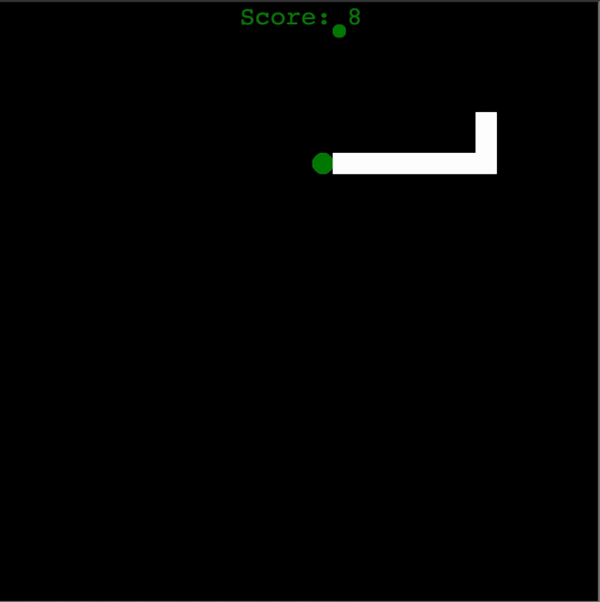

# Python3 Project: Snake-Game
## About
The goal of the project is to build a simple game in the Python language,
using various modules and object-oriented programming principles.

This project was made by Liav Shitrit.

## Source structure (Modules)
1. `main` - main function definition. Defining the rules of the game and its definitions.
2. `snake` - This class is responsible for creating and enlarging the snake as the player progresses in the game.
3. `food` - This class is responsible for creating the food objects in different places, as well as identifying when they were eaten by the snake.
4. `scoreboard` - This Class is responsible for the scoreboard. Its initial setting and update when a player gets a point.

## Usage
1. run `/python3 main.py`

The game will open in a new window

## Game controls
`w`  - moving up

`s` - moving down

`d`  - moving right

`a` - moving left
